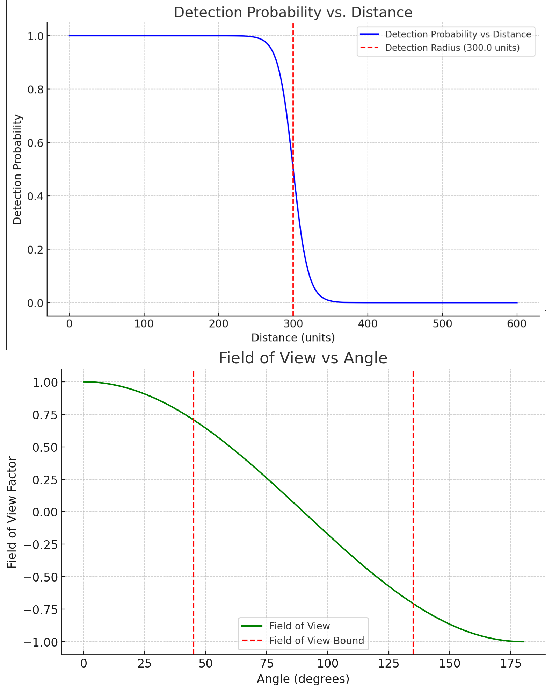

# True Faction System (TFS)

The **True Faction System** is an SKSE plugin for Skyrim Special Edition that allows the player to act as a member of various factions depending on the armor worn. The plugin uses dynamic faction recognition based on faction armors and adjusts NPC behavior accordingly.

## Features

- **Dynamic Faction Affiliation**: When the player wears armor associated with a specific faction (e.g., Bandits, Imperials, Stormcloaks), they are recognized as an ally by NPCs of that faction and are not attacked.
  
- **Multiple Faction Support**: The player can wear armor pieces from different factions simultaneously and will be recognized as an ally by NPCs from multiple factions accordingly.

- **Detection Based on Stealth Value**: The likelihood of NPCs recognizing the player as an enemy depends on the stealth value of the armor worn and proximity to the NPCs.

- **Armor-Based Stealth**: Each piece of armor has an individual "stealth value." The higher the value, the less likely the player is to be recognized by NPCs. If the stealth value falls below a certain threshold, the player is identified as an enemy and attacked.

- **Background Check**: A background process regularly checks (every 5 seconds for now) faction affiliation and detection probability without requiring the player to change their armor.

## Detection Probability Formula

The detection probability is calculated based on the player's distance from NPCs and the player's disguise value. The probability decreases smoothly with distance and is determined by the following formula:

```
distanceFactor = 1.0 / (1.0 + exp((distance - DETECTION_RADIUS) * 0.1))
```

This creates a smooth transition in the detection probability as the player gets further from the NPC. The graph below illustrates how detection probability decreases with distance:



## Installation Instructions

1. **SKSE64** (Skyrim Script Extender) must be installed.
2. Copy the `.dll` file into your `Skyrim/Data/SKSE/Plugins` folder.
3. Start the game and test the plugin by wearing faction armors and approaching the corresponding faction NPCs.

## Usage Instructions

- **Wearing Faction Armor**: When you wear armor from a faction (e.g., Bandit Armor), you can move undetected within that faction's camps. NPCs will only attack you if they recognize that you do not truly belong to their faction.

- **Mixing Faction Armors**: You can combine armor pieces from different factions. The stealth value for each faction is calculated individually based on the worn armor pieces belonging to that faction.

- **Approaching NPCs**: The closer you get to NPCs, the higher the chance they will recognize you as an enemy, especially if your stealth value for their faction is low.

- **Switching Gear**: The stealth value is automatically updated when you equip or unequip items. An event handler monitors equipment changes and adjusts faction affiliation accordingly.

## Development and Future Goals

### Current Features:

- Extended faction detection: Support for multiple factions simultaneously, based on worn armor pieces.
- Dynamic stealth value: Calculation of stealth value for each faction individually, depending on worn faction armors.
- Background process: Automatic checking of faction affiliation and detection probability every 5 seconds without player intervention.
- Combat system: NPCs will attack the player when they recognize them as an enemy. Attacking faction NPCs removes the player from that faction.

### Planned Features:

- Improved detection logic: Considering NPC level, line of sight, environment, and other factors in faction detection.
- Quest integration: Possible integration into existing quests to adjust NPC behavior based on the player’s disguise.
- Mod support: Support for custom faction armors and factions from mods.
- Configurable settings: Allow players to customize settings such as check intervals, stealth thresholds, and more.

## Known Issues

- **Faction change delay**: There may be a slight delay before the player's faction affiliation is updated, as the check occurs at intervals.
- **Detection logic**: Currently, the detection probability is primarily based on stealth value and distance. Additional factors are not yet implemented.
- **Compatibility with other mods**: The plugin may conflict with mods that alter factions or armor keywords. Comprehensive mod compatibility is planned.
